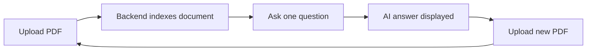

<div align="center">

# RAG Chatbot · Frontend

A modern React interface for **Retrieval-Augmented Generation** over your PDFs.  
Upload a document, ask one focused question, and read the AI answer — then start fresh with the next file.

<br />


</div>

---

## Overview

This app is the **client** for a RAG backend. It does not run embeddings or LLM inference itself — it talks to a local API that indexes PDFs and answers questions from that context.

The experience is intentionally simple:

1. **Upload** a PDF → the backend indexes it  
2. **Ask** exactly **one** question about that document  
3. **Read** the answer in the chat area  
4. **Upload another PDF** → the screen resets and you can ask one new question  

There is no chat history across documents. Each upload is a clean session.

---

## Features

| Feature | Description |
|--------|-------------|
| **PDF upload** | Drag-and-drop or click to browse; sends the file to `/upload-pdf` |
| **One question per document** | Input locks after a single Q&A so each PDF gets one focused query |
| **Session reset on upload** | Choosing a new file clears messages and state — like opening the app fresh |
| **Live chat UI** | User and AI bubbles, typing indicator, auto-scroll |
| **Responsive layout** | Centered card layout that works on mobile and desktop |
| **Error handling** | Clear feedback if the backend is unreachable |

---

## How it works



When you select a new file, the frontend calls `resetSession()` **before** the upload request, so the UI is cleared immediately. Messages and input only return after a successful upload and your next question.

---

## Prerequisites

- **Node.js** 18+ (20+ recommended)
- **npm** (or pnpm / yarn)
- A running **RAG backend** on `http://127.0.0.1:8000` with these endpoints:

| Method | Endpoint | Purpose |
|--------|----------|---------|
| `POST` | `/upload-pdf` | `multipart/form-data` with field `file` |
| `POST` | `/ask` | JSON body `{ "question": "..." }` → `{ "answer": "..." }` |

> The API base URL is currently hardcoded in `src/App.jsx`. Point it at your backend host if you deploy elsewhere.

---

## Quick start

```bash
# Clone and enter the project
cd rag-chatbot-frontend

# Install dependencies
npm install

# Start the dev server (default: http://localhost:5173)
npm run dev
```

Make sure your backend is running on port **8000**, then:

1. Open the app in the browser  
2. Upload a PDF  
3. Type your question and press **Enter** or click **Send**  
4. Upload another PDF when you want to ask about a different document  

---

## Scripts

| Command | Description |
|---------|-------------|
| `npm run dev` | Start Vite dev server with hot reload |
| `npm run build` | Production build → `dist/` |
| `npm run preview` | Serve the production build locally |
| `npm run lint` | Run ESLint |

---

## Project structure

```
rag-chatbot-frontend/
├── public/              # Static assets
├── src/
│   ├── App.jsx          # Main UI + API calls
│   ├── index.css        # Tailwind + custom animations
│   └── main.jsx         # React entry point
├── index.html
├── vite.config.js       # Vite + Tailwind plugin
└── package.json
```

---

## Tech stack

- **[React 19](https://react.dev/)** — UI components and state  
- **[Vite 8](https://vite.dev/)** — dev server and bundling  
- **[Tailwind CSS 4](https://tailwindcss.com/)** — styling via `@tailwindcss/vite`  
- **[DM Sans](https://fonts.google.com/specimen/DM+Sans)** — typography (loaded in `index.html`)

---

## Configuration

### Backend URL

Update the fetch URLs in `src/App.jsx` if your API is not on `127.0.0.1:8000`:

```js
await fetch("http://127.0.0.1:8000/upload-pdf", { ... });
await fetch("http://127.0.0.1:8000/ask", { ... });
```

For production, consider environment variables (e.g. `VITE_API_URL`) and a Vite proxy during development.

### CORS

If the frontend and backend run on different origins, ensure your API allows the Vite dev origin (typically `http://localhost:5173`).

---

## Production build

```bash
npm run build
npm run preview
```

Deploy the contents of `dist/` to any static host (Vercel, Netlify, S3, etc.). Remember to set the correct API URL for your deployed backend.

---

## License

This project is private (`"private": true` in `package.json`). Add a license file if you plan to open-source it.

---

<div align="center">

**Built for focused, document-by-document Q&A.**

</div>
