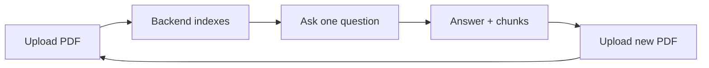

<div align="center">

# RAG Chatbot · Frontend

A modern React UI for **Retrieval-Augmented Generation** over PDFs.  
Connects to your deployed API, indexes documents on upload, and shows the full answer plus retrieved source chunks.

<br />


**Live API:** [aliashrafabbasi-rag-chatbot.hf.space](https://aliashrafabbasi-rag-chatbot.hf.space/)

</div>

---

## Overview

This repository is the **frontend only**. It does not run embeddings or LLM inference — it calls your RAG backend to upload PDFs and answer questions.

**Default backend:** `https://aliashrafabbasi-rag-chatbot.hf.space`

### User flow

1. **Upload** a PDF → backend indexes it (upload must succeed before you can ask)
2. **Ask** exactly **one** question about that document
3. **Review** the answer and expandable **retrieved chunks** used by RAG
4. **Upload another PDF** → UI resets completely for a new session

There is no chat history across documents. Each upload starts fresh.



---

## Features

| Feature | Description |
|--------|-------------|
| **Deployed API** | Points at Hugging Face Space by default; override with `VITE_API_URL` |
| **PDF upload** | Drag-and-drop; validates HTTP response before enabling questions |
| **One question per PDF** | Input locks after a single Q&A per document |
| **Full RAG response** | Shows `answer` and deduplicated `retrieved_chunks` |
| **Chunk viewer** | Expandable passages with character counts |
| **Session reset on upload** | New file clears messages and state immediately |
| **“Not in document” hints** | Explains when the API cannot answer despite retrieved text |
| **Error handling** | Upload/ask errors surface API messages when available |

---

## API contract

| Method | Endpoint | Request | Response |
|--------|----------|---------|----------|
| `POST` | `/upload-pdf` | `multipart/form-data`, field `file` | Success HTTP 2xx |
| `POST` | `/ask` | `{ "question": "..." }` | See below |

**`/ask` response (JSON):**

```json
{
  "question": "What skills are listed?",
  "answer": "The document lists Python, FastAPI, LangChain, ...",
  "retrieved_chunks": ["passage 1...", "passage 2..."]
}
```

The UI reads `answer` and `retrieved_chunks`. Duplicate chunks from the API are shown once.

---

## Quick start

```bash
git clone <your-repo-url>
cd rag-chatbot-frontend

npm install
cp .env.example .env   # optional — defaults already point at HF Space
npm run dev
```

Open **http://localhost:5173**, then:

1. Upload a PDF and wait for **“indexed”** (not just the file picker closing)
2. Ask one specific question, e.g. *“Summarize this document”* or *“What skills are listed?”*
3. Expand **Retrieved chunks** to inspect source passages
4. Upload a new PDF to start over

---

## Configuration

### Backend URL

`.env` (or copy from `.env.example`):

```env
VITE_API_URL=https://aliashrafabbasi-rag-chatbot.hf.space
```

**Local backend:**

```env
VITE_API_URL=http://127.0.0.1:8000
```

Restart the dev server after changing `.env`. URLs are built in `src/config.js`:

```js
API.uploadPdf  // {VITE_API_URL}/upload-pdf
API.ask        // {VITE_API_URL}/ask
```

### CORS

If the frontend and API are on different domains (e.g. Netlify + Hugging Face), enable CORS on your FastAPI app for:

- `http://localhost:5173` (local dev)
- Your deployed frontend origin

---

## Troubleshooting

### Answer says **“Not in document”** but chunks are shown

This text comes from the **backend**, not the frontend. The model returns it when it decides your question cannot be answered from the retrieved passages (e.g. asking about salary when the resume has no salary).

**Try questions that match the PDF content:**

- `Summarize this document`
- `What skills are listed?`
- `What projects are mentioned?`
- `Who is this document about?`

Vague or off-topic questions often trigger **Not in document** even when related chunks appear.

### Upload seems to work but answers are wrong

The app only enables questions after a **successful** upload (`HTTP 2xx`). If indexing failed, you should see a red error under the upload area. Re-upload and wait for the green **indexed** message.

### Network / CORS errors

Check the browser **Network** tab. Failed uploads or `ask` requests often show CORS or connection errors. Fix CORS on the API or verify `VITE_API_URL` has no trailing slash.

### Hugging Face Space cold starts

The first request after idle can be slow. Wait for upload indexing to finish before asking.

---

## Scripts

| Command | Description |
|---------|-------------|
| `npm run dev` | Dev server at `http://localhost:5173` |
| `npm run build` | Production build → `dist/` |
| `npm run preview` | Preview production build locally |
| `npm run lint` | Run ESLint |

---

## Project structure

```
rag-chatbot-frontend/
├── .env.example           # Example environment variables
├── public/
├── src/
│   ├── App.jsx            # Main UI, upload & ask flows
│   ├── api.js             # Response parsing, error helpers
│   ├── config.js          # API base URL & endpoints
│   ├── index.css          # Tailwind + animations
│   └── main.jsx           # Entry point
├── index.html
├── vite.config.js
└── package.json
```

---

## Tech stack

- [React 19](https://react.dev/)
- [Vite 8](https://vite.dev/)
- [Tailwind CSS 4](https://tailwindcss.com/) via `@tailwindcss/vite`
- [DM Sans](https://fonts.google.com/specimen/DM+Sans) (Google Fonts in `index.html`)

---

## Production build

```bash
npm run build
```

Deploy the `dist/` folder to Netlify, Vercel, GitHub Pages, etc.

Set `VITE_API_URL` in your host’s build environment if it differs from the default Hugging Face Space URL. If unset, `src/config.js` falls back to `https://aliashrafabbasi-rag-chatbot.hf.space`.

```bash
npm run preview   # test the build locally
```

---

## Related

| Resource | URL |
|----------|-----|
| RAG API (default) | https://aliashrafabbasi-rag-chatbot.hf.space/ |
| API docs (Swagger) | https://aliashrafabbasi-rag-chatbot.hf.space/docs |

---

<div align="center">

**One PDF · one question · full answer and source chunks.**

</div>
